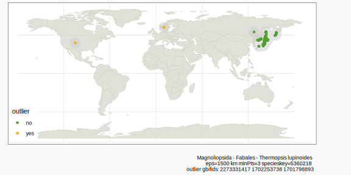
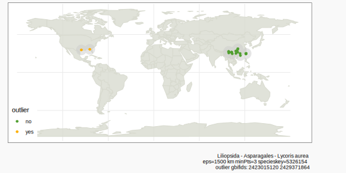
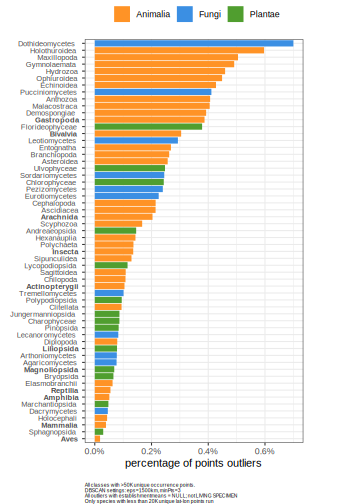
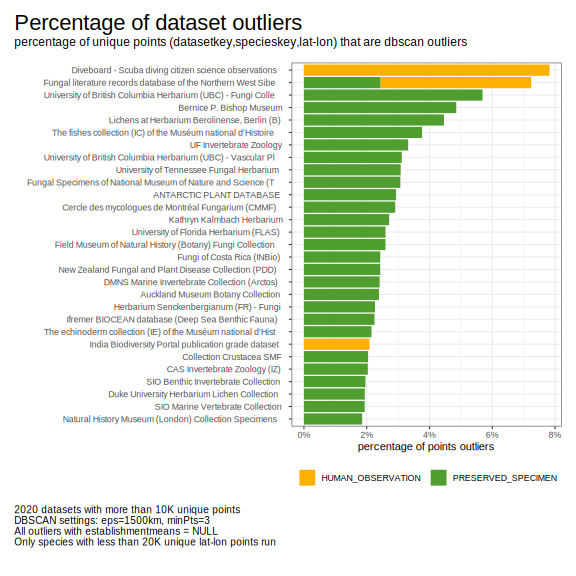

Geographic outliers at **GBIF** are a known problem. 

> **Outliers** can be errors, coordinates with high uncertainty, or simply occurrences from an under-sampled region. 

In data cleaning pipelines outliers are often removed (even if they are legitimate points) because the researcher does not have time to verify each record one-by-one. In almost all cases, outlier points are occurrences that **need attention**. Currently, there is no outlier detection implemented at **GBIF** and it is up to the user to remove outliers themselves (e.g. using CoordinateCleaner, DIVA-GIS)

<!--more-->

**DBSCAN** is a simple and popular clustering algorithm. Here is a nice [introduction](https://ltjds.github.io/post/20200611/). It uses distance and a minimum number of points per cluster to classify a point as an outlier. 

> "A density-based algorithm for discovering clusters in large spatial databases with noise" - DBSCAN

Since **GBIF** mediated occurrence data can be very patchy, clustering is important. One advantage of **DBSCAN** is that it does not need to know the expected number of clusters in advance. Also **DBSCAN** uses only distance and **not** some additional environmental variables like [Bioclim](https://www.worldclim.org/data/bioclim.html). This makes it simple, but also vulnerable to certain types of false positives.    

## Plotted Examples 

Here I plot some examples of **DBSCAN** outlier flagging.

Details : 

* **DBSCAN** was run with haversine distance.
* Maximum distance was set to **<1500km**. 
* Minimum points was set to **3**. 
* Points here are unique points by (specieskey, lat-lon).
* Only run with species having **>30** and **<30,000** unique points. 
* The gray gray circle around each point has a radius=~1500km.
* I was able to run this on **all Plants**, **Animals** and **Fungi** in under an hour with GBIF's current cluster setup. 
* No point was classified as an outlier if the publisher filled in the **establishment means** (where a publisher can put in that the occurrence is managed, in a zoo, garden ect.) or **basis of record** = **Living Specimen** or **Fossil**.

<b>Example 1</b>

The two <b>outlier points</b> ( [1](https://www.gbif.org/occurrence/2273331417), [2](https://www.gbif.org/occurrence/1702253738) )  in this example: 1. **Botanical Garden in Denver** 2. **Herbarium in Norway**. These are two points that most users would probably want to exclude. If you had 1000s of species, you would not want to do this manually.  

<b>Example 2</b>

I think most agree that these <b>two points</b> ( [1](https://www.gbif.org/occurrence/2423015120), [2](https://www.gbif.org/occurrence/2429371864) ) in North America are the most **needing of attention/verification**. These points are probably within private gardens. 

<b>Example 3</b>

Sometimes lacking **environmental information** produces results that a human being might think is probably not an outlier. In any case the result is reasonable, and out of all the points, the <b>outlier point</b> ( [1](https://www.gbif.org/occurrence/2565934285) ) is probably the one that **needs the most attention**.  

<b>Example 4</b>

This <b>outlier</b> ( [1](https://www.gbif.org/occurrence/1928465280) ) is near a **botanical garden**. 

<b>Example 5</b>

This  example shows that **DBSCAN** is able to **cluster effectively** while flagging an <b>outlier point</b>( [1](https://www.gbif.org/occurrence/1829967830) ) with low additional support in Japan.

<b>Example 6</b>

S
This example shows that **DBSCAN** does not do well when the species is poorly sampled in some regions, like the ocean. Also **DBSCAN** tends to flag occurrences on **islands** and **other remote places**. 

## Outlier detection vs error detection

**Outlier** detection and **error** detection are different. If your goal is to produce a system with no false positives, **it will fail**. Probably combining this distance method with other environmentally informed methods would be very powerful way to flag outliers. 

**Advantages** of DBSCAN :

* Simple
* Easy to Understand
* Only two parameters to set 
* Scales well

**Drawbacks** : 

* Only uses distance
* Must choose parameter settings
* Sensitive to sparse global sampling  
* Does not include any other relevant information

<blockquote class="twitter-tweet">
If you are interested in using biodiversity data you need to understand what it means. An example using <a href="https://twitter.com/atlaslivingaust?ref_src=twsrc%5Etfw">@atlaslivingaust</a> data for Onychophora: the records far from the wetter margins of the continent are all either geocodes for states (WHY WOULD ANYONE DO THIS?) or bad geocodes. <a href="https://t.co/IZgZ9PgSIx">pic.twitter.com/IZgZ9PgSIx</a>
&mdash; Nick Porch (@InvertoPhiles) <a href="https://twitter.com/InvertoPhiles/status/1290864975574114305?ref_src=twsrc%5Etfw">August 5, 2020</a></blockquote> 

DBSCAN **would not** do well at flagging any of the outlier's in this example from twitter. Environmentally-informed [reverse jackknifing](
https://www.gbif.org/document/80528/principles-and-methods-of-data-cleaning-primary-species-and-species-occurrence-data) would probably do better in these cases. 

## Percentage of taxa-group outliers

Well sampled groups like Birds, Mammals, and flowering plants do not have many outliers. Less well-sampled groups, will have more outliers, which might not be "errors" but false positives caused by sparse sampling. Fortunately, if the class is somewhat well sampled >50K records, the outlier flagging rate is less than 1% points.   

It is difficult to judge whether a dataset with a high percentage of outliers contains more "errors" or whether it has occurrences from under sampled regions (like the ocean or Siberia).

## Current implementation details 

Currently this DBSCAN-outlier detection is an **internal tool**. I am using it to find errors and assess dataset quality. It is a Spark job written in Scala ( [github](https://github.com/jhnwllr/gbif-dbscan-outliers) ).

Let me know in the comments if **DBSCAN-based-outlier flagging** is something **GBIF** should do? 

<!--more-->
