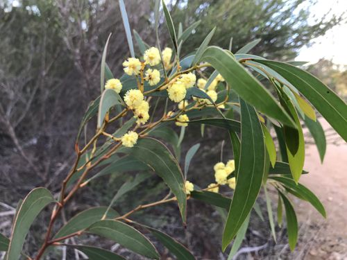
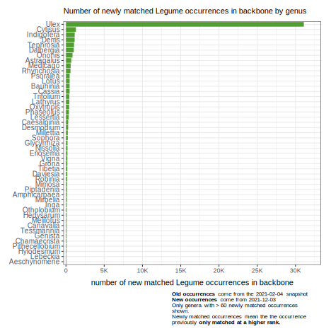

**The World Checklist of Vascular Plants (WCVP): Fabaceae** is a new GBIF mediated [checklist](https://www.gbif.org/fr/dataset/f7053f73-74fb-4c9f-ab63-de28c61140c2) that drastically increases the coverage of the family Fabaceae in the **GBIF backbone**. This work was done by the Legume Phylogeny Working Group Taxonomic. More information about this process can be found [here](https://www.legumedata.org/post/2021/updatedtaxonomicchecklist/) and with several collaborators we are working on a manuscript that will detail the process.

The new [Legume Data Portal](https://www.legumedata.org/), a [GBIF hosted portal](https://www.gbif.org/news/6RG9WSU3knIxyhcDUBQTJY/first-five-hosted-portals-emerge-from-gbif-pilot-programme), contains a [taxonomic section](https://www.legumedata.org/taxonomy/species-list) that permits [browse](https://www.legumedata.org/taxonomy/browse) and [search](https://www.legumedata.org/taxonomy/search) access to this taxonomy.

<!--more-->

<small><i>Acacia leiophylla Benth.</i> is one of the names added to the GBIF Backbone. [dudz](https://www.inaturalist.org/photos/66470341) 
[*](https://www.gbif.org/occurrence/2603289072)</small>

The [checklist](https://www.gbif.org/fr/dataset/f7053f73-74fb-4c9f-ab63-de28c61140c2) has more than **87K** names. Over <b>30K</b> of these names are new to the GBIF backbone. Around <b>44K</b> of these names were already in the GBIF backbone prior to publication of the **WCVP:(Fabacea)** checklist, but are now sourced from this checklist.  

Many thousands of names were added across many genera in the family. From the graph it is clear that some genera more than doubled the number of names in the group (Medicago,Ononis,Lathyrus...).

## Higher-rank matches

**JM will write a paragraph explaining more about higher-rank matches**

After incorporating WCVP:(Fabaceae) into the GBIF taxonomic backbone, around **50K** occurrences which previously only matched to the GBIF backbone taxonomy at a [higher rank](https://data-blog.gbif.org/post/issues-and-flags/), now get matched to the backbone with no higher-rank flag. As can be seen in the graph, most of these newly matched occurrences are coming from the genus Ulex. This large increase is due to one paritcular new name in WCVP taxonomy ....

There are still around [200K Legume occurrences](https://www.gbif.org/occurrence/search?has_coordinate=true&has_geospatial_issue=false&issue=TAXON_MATCH_HIGHERRANK&taxon_key=5386)
 that get flagged as matching at a higher rank. More than **70%** (140K) of these higher rank matches however are **varieties** or **subspecies** that get moved to a species level rank because of a missing name in the GBIF backbone (or misspelling, missing authorship ect.). This is a common event, especially at subspecific levels. If there many subspecific names and the occurnece arrives without authority then our name matching tool cannot choose between the subspecific taxa and it "snaps" to the species.  In essence no information has been lost in the name matching we jsut can utilile all levels of the taxonomy.  Naturally this is more common in groups with manny cultivated species such as the legumes.

Decreasing the number of [higher-rank matches](https://data-blog.gbif.org/post/issues-and-flags/) is a way for GBIF to measure if the taxonomic backbone is improving. There are cases, however, when adding more names to a group can actually **increase** the number higher-rank matches in GBIF. 

This happens, for example, when GBIF only had one low-rank name but an update adds more names. Within Legumes, publishers who previously published occurrences with a [dwc:scientificName](https://dwc.tdwg.org/terms/#dwc:scientificName) set to  **Acacia auriculiformis** would get matched to the only available name at that time _Acacia auriculaeformis Benth._[*](https://www.gbif.org/species/2981002) but now there are [two names](https://api.gbif.org/v1/species/match?name=Acacia%20auriculiformis&verbose=TRUE) for GBIF interpretation to choose from : 

1) _Acacia auriculiformis A.Cunn._[*](https://www.gbif.org/species/8587163)  
2) _Acacia auriculaeformis Benth._[*](https://www.gbif.org/species/2981002)

_Acacia auriculiformis A.Cunn._ is a synonym of _Acacia auriculaeformis Benth._ but GBIF interpretation has no way to tell if a publisher means the synonym or the accepted species. **Really, oh I see, let me look into this one**

## Legume Phylogeny Working Group (LPWG) 

This effort was undertaken by the **Legume Phylogeny Working Group’s (LPWG)**. [The World Checklist of Vascular Plants (Fabaceae)](https://www.gbif.org/dataset/f7053f73-74fb-4c9f-ab63-de28c61140c2) is a subset of [The World Checklist of Vascular Plants (WCVP)](https://www.gbif.org/dataset/f382f0ce-323a-4091-bb9f-add557f3a9a2). It is published by the [Kew The Royal Botanic Gardens](https://www.gbif.org/publisher/061b4f20-f241-11da-a328-b8a03c50a862). 
